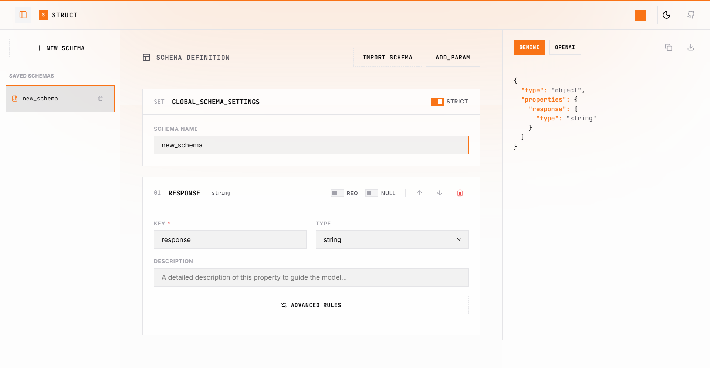

<p align="center">
  
</p>

<h1 align="center">˗ˏˋ struct ´ˎ˗</h1>

<p align="center">
  <strong>The visual IDE for AI data structures.</strong><br />
  Build complex JSON schemas in seconds, validate instantly, and export directly to your agent.
</p>

<p align="center">
  <a href="https://struct.unburn.tech"><strong>struct.unburn.tech »</strong></a>
  <br />
  <br />
  <a href="https://github.com/kunalkandepatil/struct/issues">Report Bug</a>
  ·
  <a href="https://github.com/kunalkandepatil/struct/issues">Request Feature</a>
</p>

<p align="center">
  
</p>

---

### 🟧 Why Struct?

Building structured outputs for LLMs (Gemini, OpenAI, Anthropic) can be tedious. Manually writing JSON Schemas is error-prone and slow. **Struct** turns this into a visual, intuitive experience. 

Whether you're building a simple contact form extractor or a complex multi-agent reasoning engine, Struct gives you the tools to design, iterate, and deploy your data structures with confidence.

---

### 🟧 Key Features

- 1️⃣ **Visual Schema Builder** - Drag-and-drop interface for nested objects, arrays, and primitive types.
- 2️⃣ **AI-Powered Generation** - Just describe your schema in plain English. Google Gemini handles the rest.
- 3️⃣ **Dynamic Themes** - Personalize your workspace with 5+ premium accent colors and a polished dark/light mode.
- 4️⃣ **Privacy First** - Your data never leaves your browser. All drafts and history are stored locally.
- 5️⃣ **Instant Validation** - Get real-time feedback on your schema's validity as you build.
- 6️⃣ **One-Click Export** - Copy your work as a valid JSON Schema.

---

### 🟧 Getting Started

#### Installation

1️⃣ **Clone the repository**
   ```bash
   git clone https://github.com/kunalkandepatil/struct.git
   ```

2️⃣ **Install dependencies**
   ```bash
   npm install
   ```

3️⃣ **Start the development server**
   ```bash
   npm run dev
   ```

---

### 🎧 Support Server
<a href="https://discord.gg/W8wTjESM3t"></a>
